Chapter 6 - ISLR - MATH 356
================

# Model Selection

This is an R Quarto document. Quarto is a simple formatting syntax for
authoring web pages, and a very nice way of distributing an analysis. It
has some very simple syntax rules.

``` r
library(ISLR)
library(tidyverse)
```

    ── Attaching packages ─────────────────────────────────────── tidyverse 1.3.2 ──
    ✔ ggplot2 3.3.6     ✔ purrr   0.3.4
    ✔ tibble  3.1.8     ✔ dplyr   1.0.9
    ✔ tidyr   1.2.0     ✔ stringr 1.4.0
    ✔ readr   2.1.2     ✔ forcats 0.5.1
    ── Conflicts ────────────────────────────────────────── tidyverse_conflicts() ──
    ✖ dplyr::filter() masks stats::filter()
    ✖ dplyr::lag()    masks stats::lag()

``` r
glimpse(Hitters)
```

    Rows: 322
    Columns: 20
    $ AtBat     <int> 293, 315, 479, 496, 321, 594, 185, 298, 323, 401, 574, 202, …
    $ Hits      <int> 66, 81, 130, 141, 87, 169, 37, 73, 81, 92, 159, 53, 113, 60,…
    $ HmRun     <int> 1, 7, 18, 20, 10, 4, 1, 0, 6, 17, 21, 4, 13, 0, 7, 3, 20, 2,…
    $ Runs      <int> 30, 24, 66, 65, 39, 74, 23, 24, 26, 49, 107, 31, 48, 30, 29,…
    $ RBI       <int> 29, 38, 72, 78, 42, 51, 8, 24, 32, 66, 75, 26, 61, 11, 27, 1…
    $ Walks     <int> 14, 39, 76, 37, 30, 35, 21, 7, 8, 65, 59, 27, 47, 22, 30, 11…
    $ Years     <int> 1, 14, 3, 11, 2, 11, 2, 3, 2, 13, 10, 9, 4, 6, 13, 3, 15, 5,…
    $ CAtBat    <int> 293, 3449, 1624, 5628, 396, 4408, 214, 509, 341, 5206, 4631,…
    $ CHits     <int> 66, 835, 457, 1575, 101, 1133, 42, 108, 86, 1332, 1300, 467,…
    $ CHmRun    <int> 1, 69, 63, 225, 12, 19, 1, 0, 6, 253, 90, 15, 41, 4, 36, 3, …
    $ CRuns     <int> 30, 321, 224, 828, 48, 501, 30, 41, 32, 784, 702, 192, 205, …
    $ CRBI      <int> 29, 414, 266, 838, 46, 336, 9, 37, 34, 890, 504, 186, 204, 1…
    $ CWalks    <int> 14, 375, 263, 354, 33, 194, 24, 12, 8, 866, 488, 161, 203, 2…
    $ League    <fct> A, N, A, N, N, A, N, A, N, A, A, N, N, A, N, A, N, A, A, N, …
    $ Division  <fct> E, W, W, E, E, W, E, W, W, E, E, W, E, E, E, W, W, W, W, W, …
    $ PutOuts   <int> 446, 632, 880, 200, 805, 282, 76, 121, 143, 0, 238, 304, 211…
    $ Assists   <int> 33, 43, 82, 11, 40, 421, 127, 283, 290, 0, 445, 45, 11, 151,…
    $ Errors    <int> 20, 10, 14, 3, 4, 25, 7, 9, 19, 0, 22, 11, 7, 6, 8, 0, 10, 1…
    $ Salary    <dbl> NA, 475.000, 480.000, 500.000, 91.500, 750.000, 70.000, 100.…
    $ NewLeague <fct> A, N, A, N, N, A, A, A, N, A, A, N, N, A, N, A, N, A, A, N, …

``` r
skimr::skim(Hitters)
```

|                                                  |         |
|:-------------------------------------------------|:--------|
| Name                                             | Hitters |
| Number of rows                                   | 322     |
| Number of columns                                | 20      |
| \_\_\_\_\_\_\_\_\_\_\_\_\_\_\_\_\_\_\_\_\_\_\_   |         |
| Column type frequency:                           |         |
| factor                                           | 3       |
| numeric                                          | 17      |
| \_\_\_\_\_\_\_\_\_\_\_\_\_\_\_\_\_\_\_\_\_\_\_\_ |         |
| Group variables                                  | None    |

Data summary

**Variable type: factor**

| skim_variable | n_missing | complete_rate | ordered | n_unique | top_counts     |
|:--------------|----------:|--------------:|:--------|---------:|:---------------|
| League        |         0 |             1 | FALSE   |        2 | A: 175, N: 147 |
| Division      |         0 |             1 | FALSE   |        2 | W: 165, E: 157 |
| NewLeague     |         0 |             1 | FALSE   |        2 | A: 176, N: 146 |

**Variable type: numeric**

| skim_variable | n_missing | complete_rate |    mean |      sd |   p0 |    p25 |    p50 |     p75 |  p100 | hist  |
|:--------------|----------:|--------------:|--------:|--------:|-----:|-------:|-------:|--------:|------:|:------|
| AtBat         |         0 |          1.00 |  380.93 |  153.40 | 16.0 | 255.25 |  379.5 |  512.00 |   687 | ▁▇▇▇▅ |
| Hits          |         0 |          1.00 |  101.02 |   46.45 |  1.0 |  64.00 |   96.0 |  137.00 |   238 | ▃▇▆▃▁ |
| HmRun         |         0 |          1.00 |   10.77 |    8.71 |  0.0 |   4.00 |    8.0 |   16.00 |    40 | ▇▃▂▁▁ |
| Runs          |         0 |          1.00 |   50.91 |   26.02 |  0.0 |  30.25 |   48.0 |   69.00 |   130 | ▅▇▆▃▁ |
| RBI           |         0 |          1.00 |   48.03 |   26.17 |  0.0 |  28.00 |   44.0 |   64.75 |   121 | ▃▇▃▃▁ |
| Walks         |         0 |          1.00 |   38.74 |   21.64 |  0.0 |  22.00 |   35.0 |   53.00 |   105 | ▅▇▅▂▁ |
| Years         |         0 |          1.00 |    7.44 |    4.93 |  1.0 |   4.00 |    6.0 |   11.00 |    24 | ▇▆▃▂▁ |
| CAtBat        |         0 |          1.00 | 2648.68 | 2324.21 | 19.0 | 816.75 | 1928.0 | 3924.25 | 14053 | ▇▃▂▁▁ |
| CHits         |         0 |          1.00 |  717.57 |  654.47 |  4.0 | 209.00 |  508.0 | 1059.25 |  4256 | ▇▃▁▁▁ |
| CHmRun        |         0 |          1.00 |   69.49 |   86.27 |  0.0 |  14.00 |   37.5 |   90.00 |   548 | ▇▁▁▁▁ |
| CRuns         |         0 |          1.00 |  358.80 |  334.11 |  1.0 | 100.25 |  247.0 |  526.25 |  2165 | ▇▂▁▁▁ |
| CRBI          |         0 |          1.00 |  330.12 |  333.22 |  0.0 |  88.75 |  220.5 |  426.25 |  1659 | ▇▂▁▁▁ |
| CWalks        |         0 |          1.00 |  260.24 |  267.06 |  0.0 |  67.25 |  170.5 |  339.25 |  1566 | ▇▂▁▁▁ |
| PutOuts       |         0 |          1.00 |  288.94 |  280.70 |  0.0 | 109.25 |  212.0 |  325.00 |  1378 | ▇▃▁▁▁ |
| Assists       |         0 |          1.00 |  106.91 |  136.85 |  0.0 |   7.00 |   39.5 |  166.00 |   492 | ▇▂▁▁▁ |
| Errors        |         0 |          1.00 |    8.04 |    6.37 |  0.0 |   3.00 |    6.0 |   11.00 |    32 | ▇▅▂▁▁ |
| Salary        |        59 |          0.82 |  535.93 |  451.12 | 67.5 | 190.00 |  425.0 |  750.00 |  2460 | ▇▃▁▁▁ |

There are some missing values here, so before we proceed we will remove
them:

``` r
# drop NA rows
hitters_df <- 
  Hitters %>% 
  drop_na()
# check to see if there is NA left
with(hitters_df, sum(is.na(Salary)))
```

    [1] 0

## Best Subset regression

We will now use the package `leaps` to evaluate all the best-subset
models.

``` r
library(leaps)
regfit.full <- regsubsets(Salary~., data=Hitters)
summary(regfit.full)
```

    Subset selection object
    Call: regsubsets.formula(Salary ~ ., data = Hitters)
    19 Variables  (and intercept)
               Forced in Forced out
    AtBat          FALSE      FALSE
    Hits           FALSE      FALSE
    HmRun          FALSE      FALSE
    Runs           FALSE      FALSE
    RBI            FALSE      FALSE
    Walks          FALSE      FALSE
    Years          FALSE      FALSE
    CAtBat         FALSE      FALSE
    CHits          FALSE      FALSE
    CHmRun         FALSE      FALSE
    CRuns          FALSE      FALSE
    CRBI           FALSE      FALSE
    CWalks         FALSE      FALSE
    LeagueN        FALSE      FALSE
    DivisionW      FALSE      FALSE
    PutOuts        FALSE      FALSE
    Assists        FALSE      FALSE
    Errors         FALSE      FALSE
    NewLeagueN     FALSE      FALSE
    1 subsets of each size up to 8
    Selection Algorithm: exhaustive
             AtBat Hits HmRun Runs RBI Walks Years CAtBat CHits CHmRun CRuns CRBI
    1  ( 1 ) " "   " "  " "   " "  " " " "   " "   " "    " "   " "    " "   "*" 
    2  ( 1 ) " "   "*"  " "   " "  " " " "   " "   " "    " "   " "    " "   "*" 
    3  ( 1 ) " "   "*"  " "   " "  " " " "   " "   " "    " "   " "    " "   "*" 
    4  ( 1 ) " "   "*"  " "   " "  " " " "   " "   " "    " "   " "    " "   "*" 
    5  ( 1 ) "*"   "*"  " "   " "  " " " "   " "   " "    " "   " "    " "   "*" 
    6  ( 1 ) "*"   "*"  " "   " "  " " "*"   " "   " "    " "   " "    " "   "*" 
    7  ( 1 ) " "   "*"  " "   " "  " " "*"   " "   "*"    "*"   "*"    " "   " " 
    8  ( 1 ) "*"   "*"  " "   " "  " " "*"   " "   " "    " "   "*"    "*"   " " 
             CWalks LeagueN DivisionW PutOuts Assists Errors NewLeagueN
    1  ( 1 ) " "    " "     " "       " "     " "     " "    " "       
    2  ( 1 ) " "    " "     " "       " "     " "     " "    " "       
    3  ( 1 ) " "    " "     " "       "*"     " "     " "    " "       
    4  ( 1 ) " "    " "     "*"       "*"     " "     " "    " "       
    5  ( 1 ) " "    " "     "*"       "*"     " "     " "    " "       
    6  ( 1 ) " "    " "     "*"       "*"     " "     " "    " "       
    7  ( 1 ) " "    " "     "*"       "*"     " "     " "    " "       
    8  ( 1 ) "*"    " "     "*"       "*"     " "     " "    " "       

It gives by default best-subsets up to size 8; lets increase that to 19,
i.e. all the variables

``` r
regfit.full <- regsubsets(Salary~.,
                          data=hitters_df, 
                          nvmax=19)
reg.summary <- summary(regfit.full)
names(reg.summary)
```

    [1] "which"  "rsq"    "rss"    "adjr2"  "cp"     "bic"    "outmat" "obj"   

``` r
ggplot(data = as.tibble(reg.summary$cp), aes(x = 1:19, y = reg.summary$cp)) +
  geom_point(size = 2) +
  xlab('Number of Variables') +
  ylab('Cp')
```

    Warning: `as.tibble()` was deprecated in tibble 2.0.0.
    Please use `as_tibble()` instead.
    The signature and semantics have changed, see `?as_tibble`.
    This warning is displayed once every 8 hours.
    Call `lifecycle::last_lifecycle_warnings()` to see where this warning was generated.

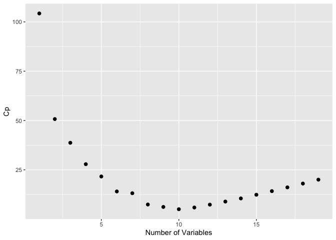

``` r
plot(reg.summary$cp,xlab="Number of Variables",ylab="Cp")
which.min(reg.summary$cp)
```

    [1] 10

``` r
points(10,reg.summary$cp[10],pch=20,col="red")
```

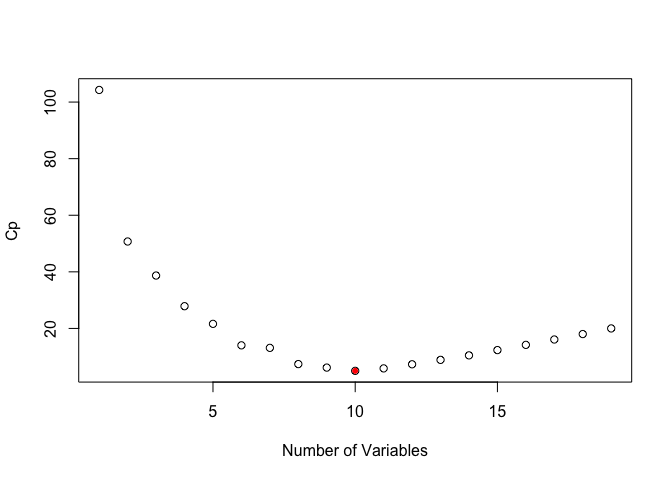

There is a plot method for the `regsubsets` object

``` r
plot(regfit.full, scale="Cp")
```

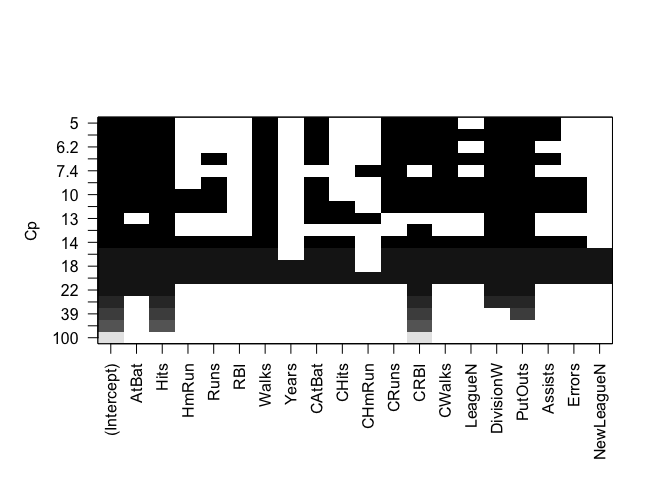

``` r
coef(regfit.full,10)
```

     (Intercept)        AtBat         Hits        Walks       CAtBat        CRuns 
     162.5354420   -2.1686501    6.9180175    5.7732246   -0.1300798    1.4082490 
            CRBI       CWalks    DivisionW      PutOuts      Assists 
       0.7743122   -0.8308264 -112.3800575    0.2973726    0.2831680 

## Forward Stepwise Selection

Here we use the `regsubsets` function but specify the \`method=“forward”
option:

``` r
regfit.fwd <- regsubsets(Salary~., 
                         data=hitters_df,
                         nvmax=19,
                         method="forward")
summary(regfit.fwd)
```

    Subset selection object
    Call: regsubsets.formula(Salary ~ ., data = hitters_df, nvmax = 19, 
        method = "forward")
    19 Variables  (and intercept)
               Forced in Forced out
    AtBat          FALSE      FALSE
    Hits           FALSE      FALSE
    HmRun          FALSE      FALSE
    Runs           FALSE      FALSE
    RBI            FALSE      FALSE
    Walks          FALSE      FALSE
    Years          FALSE      FALSE
    CAtBat         FALSE      FALSE
    CHits          FALSE      FALSE
    CHmRun         FALSE      FALSE
    CRuns          FALSE      FALSE
    CRBI           FALSE      FALSE
    CWalks         FALSE      FALSE
    LeagueN        FALSE      FALSE
    DivisionW      FALSE      FALSE
    PutOuts        FALSE      FALSE
    Assists        FALSE      FALSE
    Errors         FALSE      FALSE
    NewLeagueN     FALSE      FALSE
    1 subsets of each size up to 19
    Selection Algorithm: forward
              AtBat Hits HmRun Runs RBI Walks Years CAtBat CHits CHmRun CRuns CRBI
    1  ( 1 )  " "   " "  " "   " "  " " " "   " "   " "    " "   " "    " "   "*" 
    2  ( 1 )  " "   "*"  " "   " "  " " " "   " "   " "    " "   " "    " "   "*" 
    3  ( 1 )  " "   "*"  " "   " "  " " " "   " "   " "    " "   " "    " "   "*" 
    4  ( 1 )  " "   "*"  " "   " "  " " " "   " "   " "    " "   " "    " "   "*" 
    5  ( 1 )  "*"   "*"  " "   " "  " " " "   " "   " "    " "   " "    " "   "*" 
    6  ( 1 )  "*"   "*"  " "   " "  " " "*"   " "   " "    " "   " "    " "   "*" 
    7  ( 1 )  "*"   "*"  " "   " "  " " "*"   " "   " "    " "   " "    " "   "*" 
    8  ( 1 )  "*"   "*"  " "   " "  " " "*"   " "   " "    " "   " "    "*"   "*" 
    9  ( 1 )  "*"   "*"  " "   " "  " " "*"   " "   "*"    " "   " "    "*"   "*" 
    10  ( 1 ) "*"   "*"  " "   " "  " " "*"   " "   "*"    " "   " "    "*"   "*" 
    11  ( 1 ) "*"   "*"  " "   " "  " " "*"   " "   "*"    " "   " "    "*"   "*" 
    12  ( 1 ) "*"   "*"  " "   "*"  " " "*"   " "   "*"    " "   " "    "*"   "*" 
    13  ( 1 ) "*"   "*"  " "   "*"  " " "*"   " "   "*"    " "   " "    "*"   "*" 
    14  ( 1 ) "*"   "*"  "*"   "*"  " " "*"   " "   "*"    " "   " "    "*"   "*" 
    15  ( 1 ) "*"   "*"  "*"   "*"  " " "*"   " "   "*"    "*"   " "    "*"   "*" 
    16  ( 1 ) "*"   "*"  "*"   "*"  "*" "*"   " "   "*"    "*"   " "    "*"   "*" 
    17  ( 1 ) "*"   "*"  "*"   "*"  "*" "*"   " "   "*"    "*"   " "    "*"   "*" 
    18  ( 1 ) "*"   "*"  "*"   "*"  "*" "*"   "*"   "*"    "*"   " "    "*"   "*" 
    19  ( 1 ) "*"   "*"  "*"   "*"  "*" "*"   "*"   "*"    "*"   "*"    "*"   "*" 
              CWalks LeagueN DivisionW PutOuts Assists Errors NewLeagueN
    1  ( 1 )  " "    " "     " "       " "     " "     " "    " "       
    2  ( 1 )  " "    " "     " "       " "     " "     " "    " "       
    3  ( 1 )  " "    " "     " "       "*"     " "     " "    " "       
    4  ( 1 )  " "    " "     "*"       "*"     " "     " "    " "       
    5  ( 1 )  " "    " "     "*"       "*"     " "     " "    " "       
    6  ( 1 )  " "    " "     "*"       "*"     " "     " "    " "       
    7  ( 1 )  "*"    " "     "*"       "*"     " "     " "    " "       
    8  ( 1 )  "*"    " "     "*"       "*"     " "     " "    " "       
    9  ( 1 )  "*"    " "     "*"       "*"     " "     " "    " "       
    10  ( 1 ) "*"    " "     "*"       "*"     "*"     " "    " "       
    11  ( 1 ) "*"    "*"     "*"       "*"     "*"     " "    " "       
    12  ( 1 ) "*"    "*"     "*"       "*"     "*"     " "    " "       
    13  ( 1 ) "*"    "*"     "*"       "*"     "*"     "*"    " "       
    14  ( 1 ) "*"    "*"     "*"       "*"     "*"     "*"    " "       
    15  ( 1 ) "*"    "*"     "*"       "*"     "*"     "*"    " "       
    16  ( 1 ) "*"    "*"     "*"       "*"     "*"     "*"    " "       
    17  ( 1 ) "*"    "*"     "*"       "*"     "*"     "*"    "*"       
    18  ( 1 ) "*"    "*"     "*"       "*"     "*"     "*"    "*"       
    19  ( 1 ) "*"    "*"     "*"       "*"     "*"     "*"    "*"       

``` r
plot(regfit.fwd,
     scale="Cp")
```

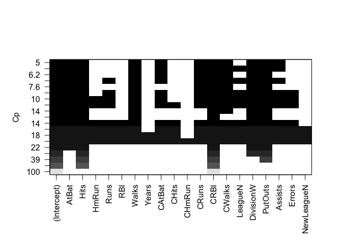

## Model Selection Using a Validation Set

Lets make a training and validation set, so that we can choose a good
subset model. We will do it using a slightly different approach from
what was done in the the book.

``` r
dim(hitters_df)
```

    [1] 263  20

``` r
set.seed(1)
train=sample(seq(263), 180, replace=FALSE)
regfit.fwd <- regsubsets(Salary~.,
                      data=hitters_df[train,],
                      nvmax=19,
                      method="forward")
```

Now we will make predictions on the observations not used for training.
We know there are 19 models, so we set up some vectors to record the
errors. We have to do a bit of work here, because there is no predict
method for `regsubsets`.

``` r
val.errors=rep(NA,19)
x.test=model.matrix(Salary~.,
                    data=hitters_df[-train,])# notice the -index!
for(i in 1:19){
  coefi=coef(regfit.fwd,id=i)
  pred=x.test[,names(coefi)]%*%coefi
  val.errors[i]=mean((hitters_df$Salary[-train]-pred)^2)
}
plot(sqrt(val.errors),ylab="Root MSE",ylim=c(300,400),pch=19,type="b")
points(sqrt(regfit.fwd$rss[-1]/180),col="blue",pch=19,type="b")
legend("topright",legend=c("Training","Validation"),col=c("blue","black"),pch=19)
```

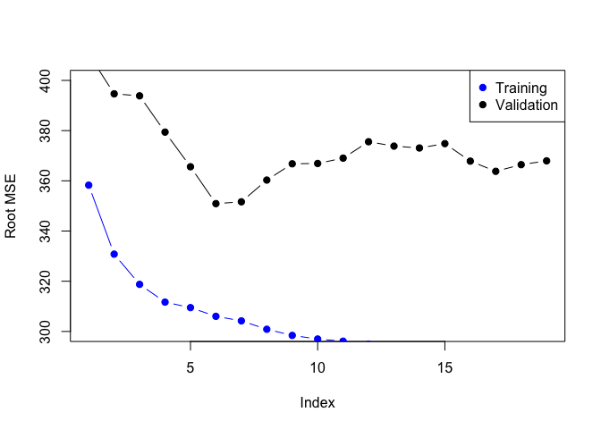

As we expect, the training error goes down monotonically as the model
gets bigger, but not so for the validation error.

This was a little tedious - not having a predict method for
`regsubsets`. So we will write one!

``` r
predict.regsubsets=function(object,newdata,id,...){
  form=as.formula(object$call[[2]])
  mat=model.matrix(form,newdata)
  coefi=coef(object,id=id)
  mat[,names(coefi)]%*%coefi
}
```

## Model Selection by Cross-Validation

We will do 10-fold cross-validation. Its really easy!

``` r
set.seed(11)
folds=sample(rep(1:10,length=nrow(hitters_df)))
folds
```

      [1] 10  4  4  4  3  7 10  8 10  3  4  2  2  1  1  5  3  3  5  9  5  2  7  3  8
     [26]  7  4  6  7  7  7 10  2  6  6  1  8  8 10  1  8  3  7 10  1  6 10  3  8  7
     [51]  9  3  6  2  5  6  5  5  2  6  4  7 10  7  1  8  1  2  8  2  1  8  2  6  4
     [76]  3  1  1  5  1  2 10  5  8  8  3  9  8  3  6  1  9  5  9  9  8  8  6  8 10
    [101]  9  8  7  8 10  1  3  1 10  5  2  5  2  4  4 10  3  6  9  7  4  3  9  8 10
    [126]  7  5  9 10  4  7  4  1  9  4  5  6  8 10  6  7  1 10  6  4  6  7  1  9  4
    [151]  2  1  7  2  5  7 10  7  9  6  9  5  5  4 10  4  2 10  9  3  3  2  9  2  6
    [176]  9  4  3  9  9  9  4  6  1  7  8  5  8 10  6  9  8  9  1  5  3  3  1  7  1
    [201]  2  9  1  9 10  3 10  3  4  6  8  2  9  5  7  2 10  4  1  6 10  3  5  5  3
    [226]  5  7  3  6  5  4  1  3  7  1  5  2  9  4  6  8  3  2  4  5 10  8  5  2  2
    [251]  2  6  3  4  7  2  6  4  8  7  1  2  6

``` r
table(folds)
```

    folds
     1  2  3  4  5  6  7  8  9 10 
    27 27 27 26 26 26 26 26 26 26 

``` r
cv.errors=matrix(NA,10,19)
for(k in 1:10){
  best.fit=regsubsets(Salary~.,data=hitters_df[folds!=k,],nvmax=19,method="forward")
  for(i in 1:19){
    pred=predict(best.fit,hitters_df[folds==k,],id=i)
    cv.errors[k,i]=mean( (hitters_df$Salary[folds==k]-pred)^2)
  }
}
rmse.cv=sqrt(apply(cv.errors,2,mean))
plot(rmse.cv,pch=19,type="b")
```

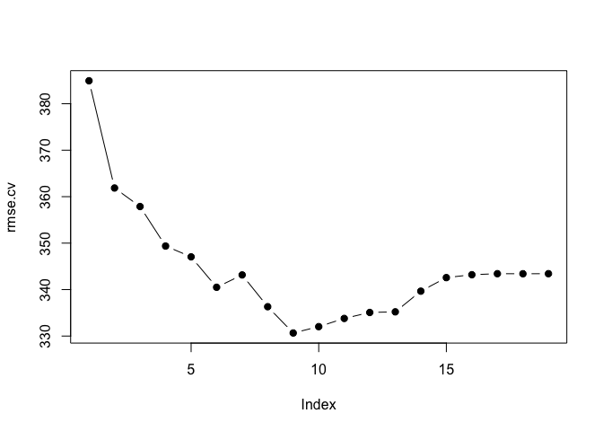

## Ridge Regression and the Lasso

We will use the package `glmnet`, which does not use the model formula
language, so we will set up an `x` and `y`.

``` r
library(glmnet)
```

    Loading required package: Matrix


    Attaching package: 'Matrix'

    The following objects are masked from 'package:tidyr':

        expand, pack, unpack

    Loaded glmnet 4.1-4

``` r
x=model.matrix(Salary~.-1,data=hitters_df) 
y=hitters_df$Salary
```

First we will fit a ridge-regression model. This is achieved by calling
`glmnet` with `alpha=0` (see the helpfile). There is also a `cv.glmnet`
function which will do the cross-validation for us.

``` r
fit.ridge=glmnet(x,y,alpha=0)
plot(fit.ridge,xvar="lambda",label=TRUE)
```

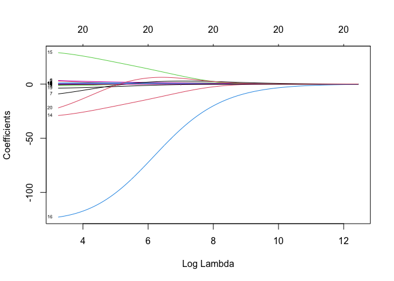

``` r
cv.ridge=cv.glmnet(x,y,alpha=0)
plot(cv.ridge)
```

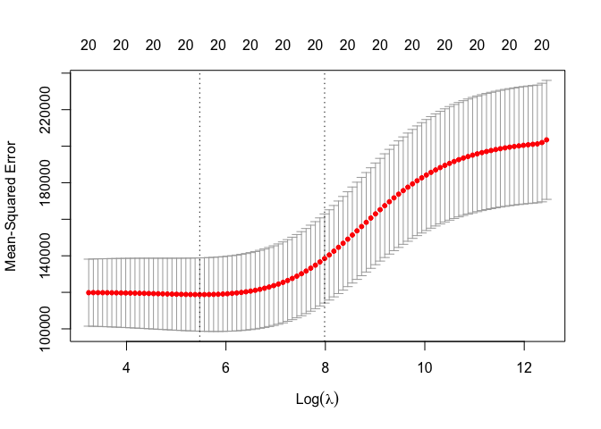

Now we fit a lasso model; for this we use the default `alpha=1`

``` r
fit.lasso=glmnet(x,y)
plot(fit.lasso,xvar="lambda",label=TRUE)
```

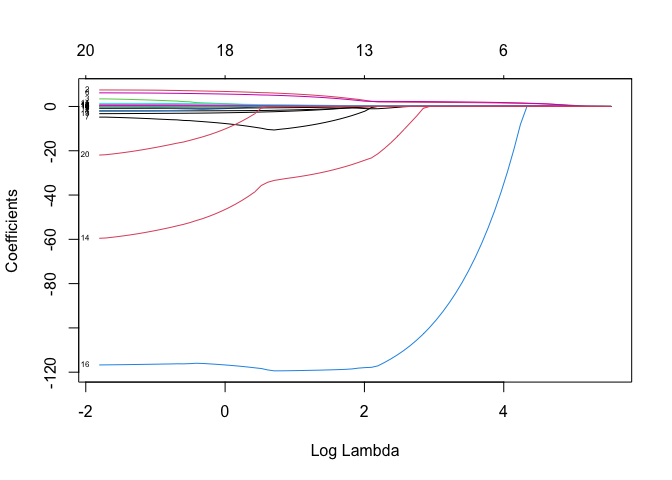

``` r
cv.lasso=cv.glmnet(x,y)
plot(cv.lasso)
```

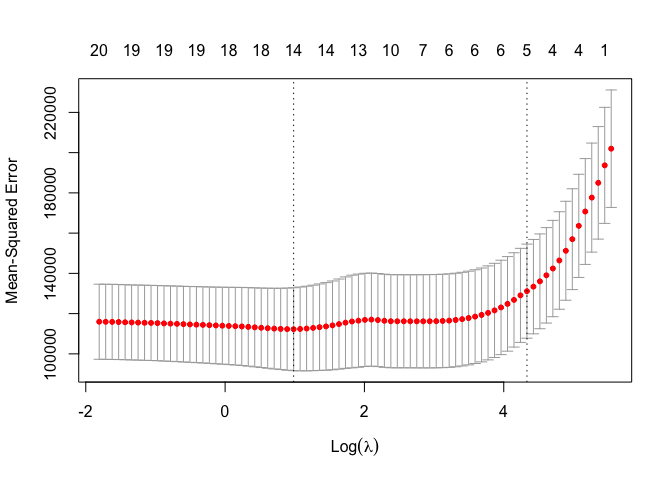

``` r
coef(cv.lasso)
```

    21 x 1 sparse Matrix of class "dgCMatrix"
                          s1
    (Intercept) 144.37970458
    AtBat         .         
    Hits          1.36380384
    HmRun         .         
    Runs          .         
    RBI           .         
    Walks         1.49731098
    Years         .         
    CAtBat        .         
    CHits         .         
    CHmRun        .         
    CRuns         0.15275165
    CRBI          0.32833941
    CWalks        .         
    LeagueA       .         
    LeagueN       .         
    DivisionW     .         
    PutOuts       0.06625755
    Assists       .         
    Errors        .         
    NewLeagueN    .         

Suppose we want to use our earlier train/validation division to select
the `lambda` for the lasso. This is easy to do.

``` r
lasso.tr=glmnet(x[train,],y[train])
lasso.tr
```


    Call:  glmnet(x = x[train, ], y = y[train]) 

       Df  %Dev  Lambda
    1   0  0.00 262.100
    2   1  5.92 238.800
    3   1 10.83 217.600
    4   1 14.91 198.300
    5   2 19.72 180.600
    6   3 23.94 164.600
    7   3 27.45 150.000
    8   3 30.37 136.700
    9   3 32.79 124.500
    10  3 34.80 113.500
    11  4 36.50 103.400
    12  5 38.77  94.190
    13  6 40.90  85.820
    14  6 42.73  78.200
    15  6 44.25  71.250
    16  6 45.51  64.920
    17  6 46.55  59.150
    18  6 47.42  53.900
    19  6 48.14  49.110
    20  6 48.74  44.750
    21  6 49.24  40.770
    22  6 49.65  37.150
    23  6 49.99  33.850
    24  7 50.28  30.840
    25  7 50.51  28.100
    26  9 50.71  25.610
    27  9 50.94  23.330
    28  9 51.12  21.260
    29  9 51.28  19.370
    30  9 51.41  17.650
    31  9 51.52  16.080
    32  9 51.60  14.650
    33  9 51.68  13.350
    34 10 51.75  12.170
    35 10 51.99  11.080
    36 11 52.23  10.100
    37 11 52.44   9.202
    38 12 52.64   8.385
    39 12 52.82   7.640
    40 12 52.97   6.961
    41 12 53.09   6.343
    42 12 53.19   5.779
    43 13 53.28   5.266
    44 15 53.53   4.798
    45 15 53.83   4.372
    46 16 54.06   3.984
    47 17 54.45   3.630
    48 17 54.79   3.307
    49 17 55.06   3.013
    50 17 55.29   2.746
    51 18 55.48   2.502
    52 18 55.65   2.280
    53 18 55.78   2.077
    54 18 55.89   1.892
    55 19 56.00   1.724
    56 19 56.16   1.571
    57 19 56.30   1.432
    58 20 56.42   1.304
    59 20 56.53   1.189
    60 20 56.63   1.083
    61 20 56.71   0.987
    62 20 56.77   0.899
    63 20 56.83   0.819
    64 20 56.88   0.746
    65 20 56.92   0.680
    66 20 56.95   0.620
    67 20 56.98   0.565
    68 20 57.00   0.514
    69 20 57.02   0.469
    70 20 57.04   0.427
    71 20 57.05   0.389
    72 20 57.06   0.355
    73 20 57.07   0.323
    74 20 57.08   0.294
    75 20 57.08   0.268
    76 20 57.09   0.244
    77 20 57.09   0.223
    78 20 57.10   0.203
    79 20 57.10   0.185
    80 20 57.11   0.168
    81 20 57.11   0.154
    82 20 57.11   0.140
    83 20 57.11   0.127

``` r
pred=predict(lasso.tr,x[-train,])
dim(pred)
```

    [1] 83 83

``` r
rmse= sqrt(apply((y[-train]-pred)^2,2,mean))
plot(log(lasso.tr$lambda),rmse,type="b",xlab="Log(lambda)")
```

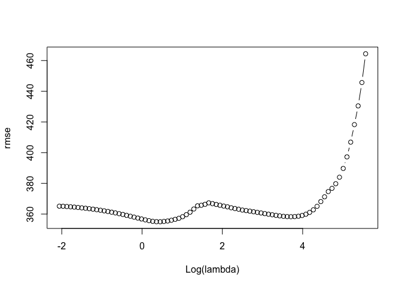

``` r
lam.best=lasso.tr$lambda[order(rmse)[1]]
lam.best
```

    [1] 1.571184

``` r
coef(lasso.tr,s=lam.best)
```

    21 x 1 sparse Matrix of class "dgCMatrix"
                           s1
    (Intercept)  2.842274e+02
    AtBat       -1.148300e+00
    Hits         4.929017e+00
    HmRun        .           
    Runs        -3.519369e+00
    RBI          3.830901e-01
    Walks        6.018286e+00
    Years       -2.074174e+01
    CAtBat      -1.903175e-02
    CHits        8.077424e-02
    CHmRun       5.349380e-01
    CRuns        7.727275e-01
    CRBI         4.920397e-01
    CWalks      -4.745867e-01
    LeagueA     -9.121313e+01
    LeagueN      1.339800e-10
    DivisionW   -1.611022e+02
    PutOuts      2.863923e-01
    Assists      2.924556e-01
    Errors      -4.692374e+00
    NewLeagueN  -5.695409e+01
