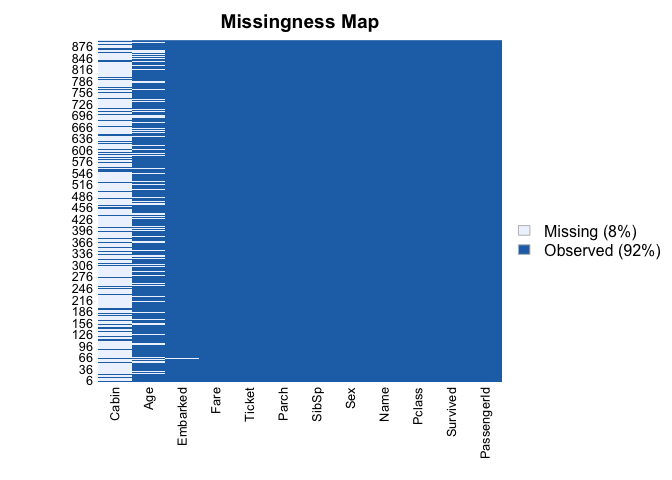
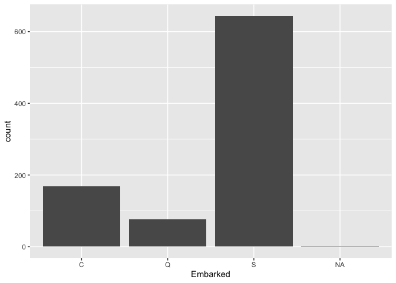
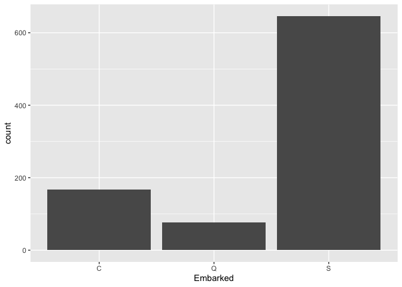
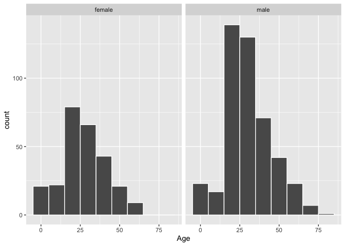

Data Cleaning exercise - titanic data
================
Tural Sadigov
August 4, 2022

## EDA

In this exercise, we will look at a famous data named titanic, and learn
some data cleaning tricks.

First, we load the tidyverse library that we will use.

``` r
library(tidyverse) # for data manipulation
```

    ## ── Attaching packages ─────────────────────────────────────── tidyverse 1.3.2 ──
    ## ✔ ggplot2 3.3.6     ✔ purrr   0.3.4
    ## ✔ tibble  3.1.8     ✔ dplyr   1.0.9
    ## ✔ tidyr   1.2.0     ✔ stringr 1.4.0
    ## ✔ readr   2.1.2     ✔ forcats 0.5.1
    ## ── Conflicts ────────────────────────────────────────── tidyverse_conflicts() ──
    ## ✖ dplyr::filter() masks stats::filter()
    ## ✖ dplyr::lag()    masks stats::lag()

``` r
titanic_train <- read_csv('train.csv')
```

    ## Rows: 891 Columns: 12
    ## ── Column specification ────────────────────────────────────────────────────────
    ## Delimiter: ","
    ## chr (5): Name, Sex, Ticket, Cabin, Embarked
    ## dbl (7): PassengerId, Survived, Pclass, Age, SibSp, Parch, Fare
    ## 
    ## ℹ Use `spec()` to retrieve the full column specification for this data.
    ## ℹ Specify the column types or set `show_col_types = FALSE` to quiet this message.

``` r
titanic_test <- read_csv('test.csv')
```

    ## Rows: 418 Columns: 11
    ## ── Column specification ────────────────────────────────────────────────────────
    ## Delimiter: ","
    ## chr (5): Name, Sex, Ticket, Cabin, Embarked
    ## dbl (6): PassengerId, Pclass, Age, SibSp, Parch, Fare
    ## 
    ## ℹ Use `spec()` to retrieve the full column specification for this data.
    ## ℹ Specify the column types or set `show_col_types = FALSE` to quiet this message.

First thing first, we should look at the data.

``` r
titanic_train %>% 
  print(n = 20)
```

    ## # A tibble: 891 × 12
    ##    PassengerId Survived Pclass Name   Sex     Age SibSp Parch Ticket  Fare Cabin
    ##          <dbl>    <dbl>  <dbl> <chr>  <chr> <dbl> <dbl> <dbl> <chr>  <dbl> <chr>
    ##  1           1        0      3 Braun… male     22     1     0 A/5 2…  7.25 <NA> 
    ##  2           2        1      1 Cumin… fema…    38     1     0 PC 17… 71.3  C85  
    ##  3           3        1      3 Heikk… fema…    26     0     0 STON/…  7.92 <NA> 
    ##  4           4        1      1 Futre… fema…    35     1     0 113803 53.1  C123 
    ##  5           5        0      3 Allen… male     35     0     0 373450  8.05 <NA> 
    ##  6           6        0      3 Moran… male     NA     0     0 330877  8.46 <NA> 
    ##  7           7        0      1 McCar… male     54     0     0 17463  51.9  E46  
    ##  8           8        0      3 Palss… male      2     3     1 349909 21.1  <NA> 
    ##  9           9        1      3 Johns… fema…    27     0     2 347742 11.1  <NA> 
    ## 10          10        1      2 Nasse… fema…    14     1     0 237736 30.1  <NA> 
    ## 11          11        1      3 Sands… fema…     4     1     1 PP 95… 16.7  G6   
    ## 12          12        1      1 Bonne… fema…    58     0     0 113783 26.6  C103 
    ## 13          13        0      3 Saund… male     20     0     0 A/5. …  8.05 <NA> 
    ## 14          14        0      3 Ander… male     39     1     5 347082 31.3  <NA> 
    ## 15          15        0      3 Vestr… fema…    14     0     0 350406  7.85 <NA> 
    ## 16          16        1      2 Hewle… fema…    55     0     0 248706 16    <NA> 
    ## 17          17        0      3 Rice,… male      2     4     1 382652 29.1  <NA> 
    ## 18          18        1      2 Willi… male     NA     0     0 244373 13    <NA> 
    ## 19          19        0      3 Vande… fema…    31     1     0 345763 18    <NA> 
    ## 20          20        1      3 Masse… fema…    NA     0     0 2649    7.22 <NA> 
    ## # … with 871 more rows, and 1 more variable: Embarked <chr>
    ## # ℹ Use `print(n = ...)` to see more rows, and `colnames()` to see all variable names

``` r
dim(titanic_train)
```

    ## [1] 891  12

We see many missing values in the Cabin variable already. There are 12
variables with 891 rows. Lets glimpse into the training data further.

``` r
dplyr::glimpse(titanic_train)
```

    ## Rows: 891
    ## Columns: 12
    ## $ PassengerId <dbl> 1, 2, 3, 4, 5, 6, 7, 8, 9, 10, 11, 12, 13, 14, 15, 16, 17,…
    ## $ Survived    <dbl> 0, 1, 1, 1, 0, 0, 0, 0, 1, 1, 1, 1, 0, 0, 0, 1, 0, 1, 0, 1…
    ## $ Pclass      <dbl> 3, 1, 3, 1, 3, 3, 1, 3, 3, 2, 3, 1, 3, 3, 3, 2, 3, 2, 3, 3…
    ## $ Name        <chr> "Braund, Mr. Owen Harris", "Cumings, Mrs. John Bradley (Fl…
    ## $ Sex         <chr> "male", "female", "female", "female", "male", "male", "mal…
    ## $ Age         <dbl> 22, 38, 26, 35, 35, NA, 54, 2, 27, 14, 4, 58, 20, 39, 14, …
    ## $ SibSp       <dbl> 1, 1, 0, 1, 0, 0, 0, 3, 0, 1, 1, 0, 0, 1, 0, 0, 4, 0, 1, 0…
    ## $ Parch       <dbl> 0, 0, 0, 0, 0, 0, 0, 1, 2, 0, 1, 0, 0, 5, 0, 0, 1, 0, 0, 0…
    ## $ Ticket      <chr> "A/5 21171", "PC 17599", "STON/O2. 3101282", "113803", "37…
    ## $ Fare        <dbl> 7.2500, 71.2833, 7.9250, 53.1000, 8.0500, 8.4583, 51.8625,…
    ## $ Cabin       <chr> NA, "C85", NA, "C123", NA, NA, "E46", NA, NA, NA, "G6", "C…
    ## $ Embarked    <chr> "S", "C", "S", "S", "S", "Q", "S", "S", "S", "C", "S", "S"…

We see that there are numeric variables and also some categorical ones
codes as characters. Survived variable is an indicator, so it should be
a factor. PassengerId is the unique identifier and can be remove for
further analysis. Pclass coded as numeric but must be categorical since
the levels show classes of passengers. Name is self-exploratory, and we
can remove it. We can skim the data with little more details.

``` r
skimr::skim(titanic_train)
```

|                                                  |               |
|:-------------------------------------------------|:--------------|
| Name                                             | titanic_train |
| Number of rows                                   | 891           |
| Number of columns                                | 12            |
| \_\_\_\_\_\_\_\_\_\_\_\_\_\_\_\_\_\_\_\_\_\_\_   |               |
| Column type frequency:                           |               |
| character                                        | 5             |
| numeric                                          | 7             |
| \_\_\_\_\_\_\_\_\_\_\_\_\_\_\_\_\_\_\_\_\_\_\_\_ |               |
| Group variables                                  | None          |

Data summary

**Variable type: character**

| skim_variable | n_missing | complete_rate | min | max | empty | n_unique | whitespace |
|:--------------|----------:|--------------:|----:|----:|------:|---------:|-----------:|
| Name          |         0 |          1.00 |  12 |  82 |     0 |      891 |          0 |
| Sex           |         0 |          1.00 |   4 |   6 |     0 |        2 |          0 |
| Ticket        |         0 |          1.00 |   3 |  18 |     0 |      681 |          0 |
| Cabin         |       687 |          0.23 |   1 |  15 |     0 |      147 |          0 |
| Embarked      |         2 |          1.00 |   1 |   1 |     0 |        3 |          0 |

**Variable type: numeric**

| skim_variable | n_missing | complete_rate |   mean |     sd |   p0 |    p25 |    p50 |   p75 |   p100 | hist  |
|:--------------|----------:|--------------:|-------:|-------:|-----:|-------:|-------:|------:|-------:|:------|
| PassengerId   |         0 |           1.0 | 446.00 | 257.35 | 1.00 | 223.50 | 446.00 | 668.5 | 891.00 | ▇▇▇▇▇ |
| Survived      |         0 |           1.0 |   0.38 |   0.49 | 0.00 |   0.00 |   0.00 |   1.0 |   1.00 | ▇▁▁▁▅ |
| Pclass        |         0 |           1.0 |   2.31 |   0.84 | 1.00 |   2.00 |   3.00 |   3.0 |   3.00 | ▃▁▃▁▇ |
| Age           |       177 |           0.8 |  29.70 |  14.53 | 0.42 |  20.12 |  28.00 |  38.0 |  80.00 | ▂▇▅▂▁ |
| SibSp         |         0 |           1.0 |   0.52 |   1.10 | 0.00 |   0.00 |   0.00 |   1.0 |   8.00 | ▇▁▁▁▁ |
| Parch         |         0 |           1.0 |   0.38 |   0.81 | 0.00 |   0.00 |   0.00 |   0.0 |   6.00 | ▇▁▁▁▁ |
| Fare          |         0 |           1.0 |  32.20 |  49.69 | 0.00 |   7.91 |  14.45 |  31.0 | 512.33 | ▇▁▁▁▁ |

We do have missing data in more than one variable: Cabin, Age and
Embarked. Lets look at the ‘missingness’ map of the training data from
Amelia package.

``` r
# missingness map
Amelia::missmap(titanic_train)
```

    ## Warning: Unknown or uninitialised column: `arguments`.
    ## Unknown or uninitialised column: `arguments`.

    ## Warning: Unknown or uninitialised column: `imputations`.

<!-- -->

Cabin variable is mostly empty, so we could choose to drop it. But since
Age is 80% complete, we could impute those missing values. Embarked only
has two missing rows, and we could also impute those. Lets remove some
variables including Cabin, and make some other variables
categorical/factor.

``` r
# manipulations
titanic_train_df <- 
  titanic_train %>% 
  select(-c(PassengerId, Name, Ticket, Cabin)) %>% 
  mutate(Survived = as.factor(Survived), 
         Pclass = as.factor(Pclass)) %>% 
  mutate_if(is.character, factor)
# skimming data
skimr::skim(titanic_train_df)
```

|                                                  |                  |
|:-------------------------------------------------|:-----------------|
| Name                                             | titanic_train_df |
| Number of rows                                   | 891              |
| Number of columns                                | 8                |
| \_\_\_\_\_\_\_\_\_\_\_\_\_\_\_\_\_\_\_\_\_\_\_   |                  |
| Column type frequency:                           |                  |
| factor                                           | 4                |
| numeric                                          | 4                |
| \_\_\_\_\_\_\_\_\_\_\_\_\_\_\_\_\_\_\_\_\_\_\_\_ |                  |
| Group variables                                  | None             |

Data summary

**Variable type: factor**

| skim_variable | n_missing | complete_rate | ordered | n_unique | top_counts             |
|:--------------|----------:|--------------:|:--------|---------:|:-----------------------|
| Survived      |         0 |             1 | FALSE   |        2 | 0: 549, 1: 342         |
| Pclass        |         0 |             1 | FALSE   |        3 | 3: 491, 1: 216, 2: 184 |
| Sex           |         0 |             1 | FALSE   |        2 | mal: 577, fem: 314     |
| Embarked      |         2 |             1 | FALSE   |        3 | S: 644, C: 168, Q: 77  |

**Variable type: numeric**

| skim_variable | n_missing | complete_rate |  mean |    sd |   p0 |   p25 |   p50 | p75 |   p100 | hist  |
|:--------------|----------:|--------------:|------:|------:|-----:|------:|------:|----:|-------:|:------|
| Age           |       177 |           0.8 | 29.70 | 14.53 | 0.42 | 20.12 | 28.00 |  38 |  80.00 | ▂▇▅▂▁ |
| SibSp         |         0 |           1.0 |  0.52 |  1.10 | 0.00 |  0.00 |  0.00 |   1 |   8.00 | ▇▁▁▁▁ |
| Parch         |         0 |           1.0 |  0.38 |  0.81 | 0.00 |  0.00 |  0.00 |   0 |   6.00 | ▇▁▁▁▁ |
| Fare          |         0 |           1.0 | 32.20 | 49.69 | 0.00 |  7.91 | 14.45 |  31 | 512.33 | ▇▁▁▁▁ |

Let’s start imputing missing values. Fir st, we look at the distribution
of Embarked.

``` r
# counts of each level
titanic_train_df %>% 
  count(Embarked)
```

    ## # A tibble: 4 × 2
    ##   Embarked     n
    ##   <fct>    <int>
    ## 1 C          168
    ## 2 Q           77
    ## 3 S          644
    ## 4 <NA>         2

``` r
# barplot
titanic_train_df %>% 
  ggplot(aes(Embarked)) +
  geom_bar()
```

<!-- -->

The level with the highest frequency is ‘S’, and lets impute the missing
values with the class that has the highest frequency.

``` r
# imputation
titanic_train_df <-  
  titanic_train_df %>% 
  mutate(Embarked = replace(Embarked,is.na(Embarked),'S'))
# counts of each level after imputation
titanic_train_df %>% 
  count(Embarked)
```

    ## # A tibble: 3 × 2
    ##   Embarked     n
    ##   <fct>    <int>
    ## 1 C          168
    ## 2 Q           77
    ## 3 S          646

``` r
# barplot
titanic_train_df %>% 
  ggplot(aes(Embarked)) +
  geom_bar()
```

<!-- -->

Investigate Age variable. Look at its distribution for each gender.

``` r
# age distribution
titanic_train_df %>% 
  ggplot(aes(x = Age)) +
  geom_histogram(color = 'white', binwidth = 10) +
  facet_wrap(~Sex)
```

    ## Warning: Removed 177 rows containing non-finite values (stat_bin).

<!-- -->

For the missing 20% of the rows, we could use various types of
imputation, but lets go with a ‘lazy’ imputation for this exercise.
Meaning, we will look the median of the ages for non-missing values, and
replace all missing ones with this median.

``` r
age_median <- 
  titanic_train_df %>% 
  summarise(median(Age, na.rm = T))
age_median
```

    ## # A tibble: 1 × 1
    ##   `median(Age, na.rm = T)`
    ##                      <dbl>
    ## 1                       28

Median age is 28. Now we do ‘lazy’ imputation. Note that replace
function below creates a lisrt instead of a numeric variable, so we also
change it back to numeric.

``` r
# fill age variable: lazy imputation
titanic_train_df <-  
  titanic_train_df %>% 
  mutate(Age = replace(Age,is.na(Age),age_median)) %>% 
  mutate(Age = unlist(Age))
skimr::skim(titanic_train_df)
```

|                                                  |                  |
|:-------------------------------------------------|:-----------------|
| Name                                             | titanic_train_df |
| Number of rows                                   | 891              |
| Number of columns                                | 8                |
| \_\_\_\_\_\_\_\_\_\_\_\_\_\_\_\_\_\_\_\_\_\_\_   |                  |
| Column type frequency:                           |                  |
| factor                                           | 4                |
| numeric                                          | 4                |
| \_\_\_\_\_\_\_\_\_\_\_\_\_\_\_\_\_\_\_\_\_\_\_\_ |                  |
| Group variables                                  | None             |

Data summary

**Variable type: factor**

| skim_variable | n_missing | complete_rate | ordered | n_unique | top_counts             |
|:--------------|----------:|--------------:|:--------|---------:|:-----------------------|
| Survived      |         0 |             1 | FALSE   |        2 | 0: 549, 1: 342         |
| Pclass        |         0 |             1 | FALSE   |        3 | 3: 491, 1: 216, 2: 184 |
| Sex           |         0 |             1 | FALSE   |        2 | mal: 577, fem: 314     |
| Embarked      |         0 |             1 | FALSE   |        3 | S: 646, C: 168, Q: 77  |

**Variable type: numeric**

| skim_variable | n_missing | complete_rate |  mean |    sd |   p0 |   p25 |   p50 | p75 |   p100 | hist  |
|:--------------|----------:|--------------:|------:|------:|-----:|------:|------:|----:|-------:|:------|
| Age           |         0 |             1 | 29.36 | 13.02 | 0.42 | 22.00 | 28.00 |  35 |  80.00 | ▂▇▃▁▁ |
| SibSp         |         0 |             1 |  0.52 |  1.10 | 0.00 |  0.00 |  0.00 |   1 |   8.00 | ▇▁▁▁▁ |
| Parch         |         0 |             1 |  0.38 |  0.81 | 0.00 |  0.00 |  0.00 |   0 |   6.00 | ▇▁▁▁▁ |
| Fare          |         0 |             1 | 32.20 | 49.69 | 0.00 |  7.91 | 14.45 |  31 | 512.33 | ▇▁▁▁▁ |

Here SibSp and Parch are number of siblings and parents of a particular
traveler. We could combine all of these into single variable that has
all family member travelers including the traveler themselves.

``` r
# combine siblings, parents together
titanic_train_df <- 
  titanic_train_df %>% 
  mutate(Travelers = SibSp + Parch + 1) %>% 
  select(-c(SibSp, Parch))
# glimpse
glimpse(titanic_train_df)
```

    ## Rows: 891
    ## Columns: 7
    ## $ Survived  <fct> 0, 1, 1, 1, 0, 0, 0, 0, 1, 1, 1, 1, 0, 0, 0, 1, 0, 1, 0, 1, …
    ## $ Pclass    <fct> 3, 1, 3, 1, 3, 3, 1, 3, 3, 2, 3, 1, 3, 3, 3, 2, 3, 2, 3, 3, …
    ## $ Sex       <fct> male, female, female, female, male, male, male, male, female…
    ## $ Age       <dbl> 22, 38, 26, 35, 35, 28, 54, 2, 27, 14, 4, 58, 20, 39, 14, 55…
    ## $ Fare      <dbl> 7.2500, 71.2833, 7.9250, 53.1000, 8.0500, 8.4583, 51.8625, 2…
    ## $ Embarked  <fct> S, C, S, S, S, Q, S, S, S, C, S, S, S, S, S, S, Q, S, S, C, …
    ## $ Travelers <dbl> 2, 2, 1, 2, 1, 1, 1, 5, 3, 2, 3, 1, 1, 7, 1, 1, 6, 1, 2, 1, …

If we need to fit any kind of machine learning algorithm, then very same
manipulations using only training data statistics need to be applied to
the testing data. We will do all of these with meta-package named
**`tidymodels`**.
